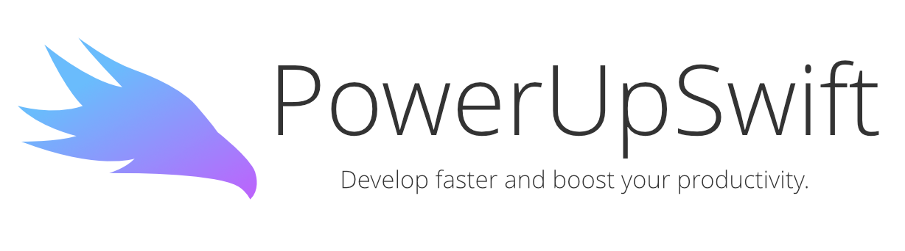
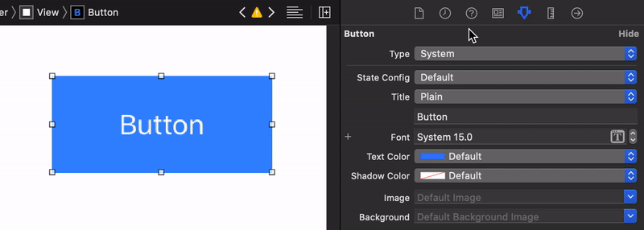

<!--[](https://travis-ci.org/cefjoeii/PowerUpSwift)-->

<p align="center">
  
</p>

<p align="center">
  
  
  
  
</p>

<!--## Example

To run the example project, clone the repo, and run `pod install` from the Example directory first.

## Requirements-->

## About
Apple doesn't provide some useful utilities to make our lives a little easier. This might be for a (good) reason, such as keeping the standard library lightweight. My experience in iOS Development was a little painful. It's usually difficult to implement a simple basic feature that you can easily do in Android built-in, so you end up doing a couple more hacks. I created this library to save time, to be more productive, and to be **DRY** (*Don't Repeat Yourself*).

## Show Some :heart: :wave:
[](https://github.com/PowerUpX/PowerUpSwift)
[](https://github.com/PowerUpX/PowerUpSwift/fork)
[](https://github.com/PowerUpX/PowerUpSwift)

[](https://github.com/cefjoeii)
[](https://facebook.com/cefjoeii)
[](https://instagram.com/cefjoeii)
[](https://twitter.com/cefjoeii)


## Demo


## Installation

PowerUpSwift is available through [CocoaPods](https://cocoapods.org/pods/PowerUpSwift). To install
it, simply add the following line to your Podfile:

```ruby
pod 'PowerUpSwift'
```

## How To Use

The documentation can be found [here](https://github.com/PowerUpX/PowerUpSwift/wiki) in the Wiki page.

## Contribute

Feel free to help out as I may have other work/life commitments. See [CONTRIBUTING.md](CONTRIBUTING.md).

## License

PowerUpSwift is available under the MIT license. See the LICENSE file for more info.
